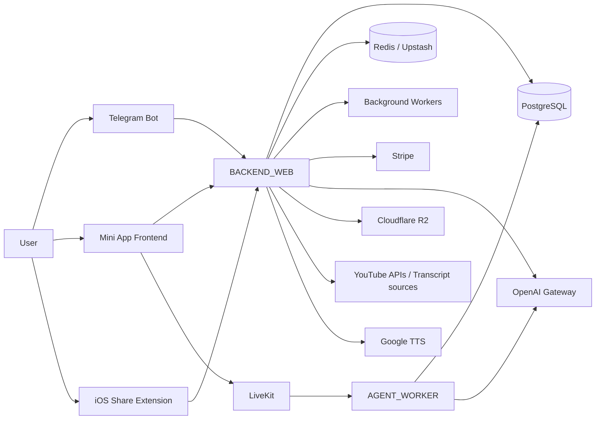
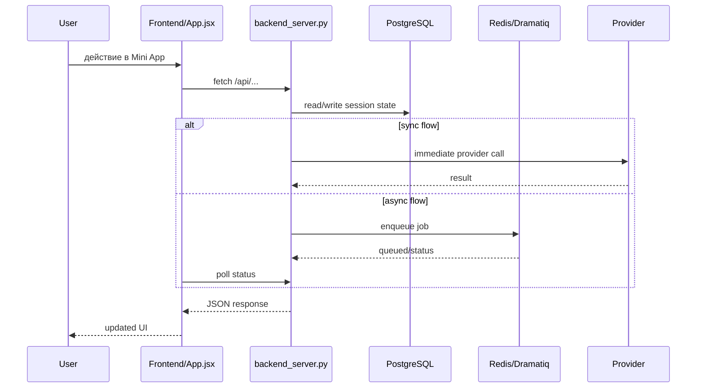
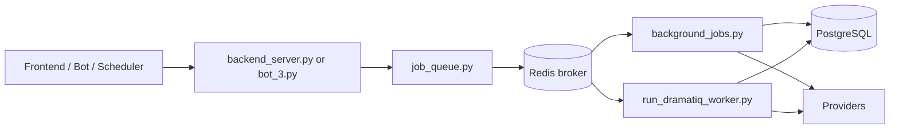
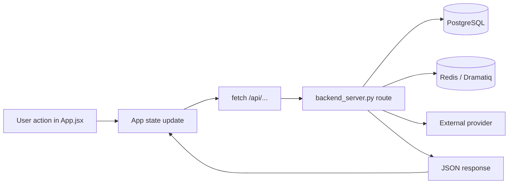

# TELEGRAM_BOT_DEUTSCHESPRACHE

Этот `README.md` не про маркетинг, а про навигацию по коду. Он описывает текущее состояние репозитория по фактическим файлам, route, entrypoint и env-переменным, найденным в коде на `2026-05-16`.

## 1. Project Overview

### Что это за проект

Это учебно-практическая платформа для изучения немецкого языка, построенная вокруг нескольких интерфейсов:

- Telegram bot: основной канал входа, команд, уведомлений, квизов и админских действий.
- Telegram Mini App / webapp: основной UI для перевода, словаря, карточек, YouTube, reader, billing, analytics и voice.
- Backend API: единый HTTP-сервер, который обслуживает frontend, mobile/iOS-интеграцию, billing и voice-related route.
- Background workers: выносят тяжёлые и длительные операции в Redis/Dramatiq.
- Scheduler service: отдельный процесс для периодических задач.
- LiveKit agent worker: отдельный voice-runtime для разговорных сценариев.

### Основные подсистемы

- Перевод и проверка переводов.
- Словарь и сохранение лексики.
- FSRS / карточки / интервальные повторения.
- YouTube transcript и перевод фрагментов.
- Reader / библиотека документов / объяснения / аудио по страницам.
- TTS generation и object storage.
- Billing / subscription / Stripe.
- Voice assistant через LiveKit.
- Analytics, планы, skill-state, daily/weekly automation.

### Основные пользовательские сценарии

- Пользователь открывает Mini App и получает персональную сессию перевода.
- Пользователь отправляет перевод и получает проверку с ошибками.
- Пользователь ищет слово, сохраняет его в словарь и затем повторяет через FSRS.
- Пользователь работает с YouTube transcript или reader-документом и вызывает объяснение/словарный lookup по выделению.
- Пользователь генерирует TTS/audio.
- Пользователь оформляет или проверяет подписку.
- Пользователь проходит голосовую сессию через LiveKit.
- Бот шлёт квизы, напоминания, summaries и обрабатывает команды.

### Какие процессы запускаются отдельно

- `BACKEND_WEB` -> Flask/Gunicorn API из `backend/web_service.py` -> `backend/backend_server.py`
- Telegram bot process -> `bot_3.py`
- `BACKGROUND_JOBS` -> Dramatiq worker на `backend.background_jobs`
- `TRANSLATION_CHECK_WORKER` -> отдельный Dramatiq worker на `backend.run_dramatiq_worker`
- `SCHEDULER_SERVICE` -> `backend.scheduler_service`
- `AGENT_WORKER` -> LiveKit agent из `backend/agent.py`
- PostgreSQL и Redis используются как внешние сервисы

## 2. High-Level Architecture



## 3. Repository Structure

### Укрупнённое дерево

```text
.
├── backend/
│   ├── backend_server.py
│   ├── database.py
│   ├── openai_manager.py
│   ├── translation_workflow.py
│   ├── job_queue.py
│   ├── background_jobs.py
│   ├── run_dramatiq_worker.py
│   ├── scheduler_service.py
│   ├── agent.py
│   ├── api.py
│   ├── voice_*_service.py
│   ├── r2_storage.py
│   ├── utils.py
│   ├── srs/fsrs_scheduler.py
│   └── tests/
├── frontend/
│   ├── src/main.jsx
│   ├── src/App.jsx
│   ├── src/components/
│   ├── src/offline/
│   └── src/utils/
├── docs/
│   ├── FSRS.md
│   ├── ios_share_extension_backend.md
│   ├── tts_generation_audit.md
│   ├── voice_architecture.md
│   ├── voice_migration_plan.md
│   └── voice_schema_draft.md
├── scripts/
├── ios/ShareExtensionTemplate/
├── bot_3.py
├── Dockerfile
├── Dockerfile.backend
├── Dockerfile.bot
├── Dockerfile.jobs
├── Dockerfile.jobs.queue
├── Dockerfile.scheduler
├── Dockerfile.agent
├── Procfile
└── requirements.txt
```

### Ключевые папки и файлы

| Path | Назначение | Кто вызывает | Что принимает / отдаёт | Внешние связи |
| --- | --- | --- | --- | --- |
| `backend/backend_server.py` | Главный Flask-сервер, route registry, orchestration, часть in-memory state | Gunicorn, bot imports, frontend HTTP, iOS, Stripe webhook | HTTP request -> JSON/HTML/static | PostgreSQL, Redis, Stripe, R2, Google TTS, YouTube, OpenAI, LiveKit |
| `backend/database.py` | DB pool, schema creation, DB access helpers | `backend_server.py`, `bot_3.py`, workers, voice services | SQL params -> rows/dicts/domain payloads | PostgreSQL |
| `backend/openai_manager.py` | LLM/TTS-adjacent provider orchestration и prompt-heavy функции | backend routes, workflow, voice tools | text/task params -> model output | OpenAI; Anthropic naming присутствует, активный client path требует проверки |
| `backend/translation_workflow.py` | Бизнес-логика translation/story sessions | `backend_server.py` | session/user params -> session payload / checking result | PostgreSQL, OpenAI path для checking |
| `backend/job_queue.py` | Enqueue layer для Dramatiq и Redis state | `backend_server.py`, scheduler, worker watchdog | payload -> queue message/status | Redis / Dramatiq |
| `backend/background_jobs.py` | Реальные Dramatiq actors | Dramatiq workers | actor args -> DB/cache/provider side effects | Redis, PostgreSQL, YouTube, Google TTS, R2, OpenAI |
| `backend/run_dramatiq_worker.py` | Отдельный translation-check worker runtime | Docker/Railway service | queue polling + watchdog | Redis / Dramatiq |
| `backend/scheduler_service.py` | APScheduler owner; только планирует jobs | Docker/Railway service | cron/time schedules -> actor `.send()` | Redis / Dramatiq, Railway control hooks |
| `backend/agent.py` | LiveKit voice agent | Docker/Railway service | LiveKit room events -> transcript/tool/assessment side effects | LiveKit, OpenAI, PostgreSQL |
| `backend/api.py` | Tool layer для voice agent (`GermanTeacherTools`) | `backend/agent.py` | tool args -> grammar/help/bookmark/quiz output | OpenAI, PostgreSQL |
| `backend/voice_session_service.py` | Voice session persistence | `backend_server.py`, `agent.py` | session/transcript events -> DB rows | PostgreSQL |
| `backend/voice_assessment_service.py` | Пост-сессионная оценка voice practice | `/api/assistant/session/complete` | session_id -> assessment | PostgreSQL, OpenAI path |
| `backend/voice_skill_bridge_service.py` | Перенос результатов voice в skill-state | `/api/assistant/session/complete` | session_id -> skill updates | PostgreSQL |
| `backend/r2_storage.py` | Cloudflare R2 storage helper | backend routes, jobs | bytes/meta -> object key/public URL | Cloudflare R2 |
| `backend/srs/fsrs_scheduler.py` | FSRS scheduling logic | card routes, review handlers | card state/review -> next due/schedule | PostgreSQL state around cards |
| `frontend/src/main.jsx` | Frontend bootstrap, app mode, version check, service worker policy | browser / Telegram WebApp | page load -> React app mount | `BACKEND_WEB`, Telegram WebApp runtime |
| `frontend/src/App.jsx` | Главный frontend orchestration file | `main.jsx` | UI state + direct `fetch('/api/...')` | `BACKEND_WEB`, LiveKit |
| `frontend/src/components/ReaderSection.jsx` | Reader presentation layer | `App.jsx` | props -> reader UI | backend through parent callbacks |
| `frontend/src/components/LiveKitRuntime.jsx` | Thin wrapper for voice UI/runtime | `App.jsx` | token/room props -> LiveKit session | LiveKit |
| `frontend/src/offline/baseDictCache.js` | Offline cache для base dictionary pack | `App.jsx` | API payload -> cached pack | `/api/webapp/dictionary/offline-pack` |
| `frontend/src/offline/vocabCache.js` | Offline/local cache vocab + card queue hints | `App.jsx` | vocab/cards payload -> local cache | Mini App offline support |
| `bot_3.py` | Telegram bot, callbacks, commands, scheduled bot tasks | Python process / PTB runtime | Telegram updates -> messages/actions | Telegram Bot API, PostgreSQL, backend imports, OpenAI paths |
| `ios/ShareExtensionTemplate/` | iOS main app + share extension template | Xcode targets | copied text / token / URL -> mobile dictionary API | `BACKEND_WEB` |
| `docs/` | Точечные архитектурные заметки и audits | человек | markdown docs | нет |
| `scripts/` | Utility/load-test/audit scripts | manual execution | script args -> reports/analysis | varies |
| `backend/tests/` | Python tests на workflow, billing, voice, today и др. | pytest | test fixtures -> assertions | local DB stubs/mocks |

### Что важно знать о структуре

- Отдельного “тонкого API layer” на frontend нет: почти все вызовы идут прямо из `frontend/src/App.jsx`.
- Отдельной системы миграций вроде Alembic не найдено: схема создаётся и расширяется кодом в `backend/database.py`.
- `backend/backend_server.py` и `bot_3.py` большие и монолитные; их лучше читать как карты маршрутов, а не как первые файлы для детального понимания.
- `docs/` содержит полезные локальные deep-dive документы, но не заменяет основной runtime map.

## 4. Runtime Processes

| Process | Entrypoint | Deploy / command | Критичные env | Что импортирует и делает | Риски / ограничения |
| --- | --- | --- | --- | --- | --- |
| `BACKEND_WEB` | `backend/backend_server:app` | `Procfile`, `Dockerfile.backend`, Gunicorn | `DATABASE_URL_RAILWAY`, `REDIS_URL`/`RAILWAY_REDIS_URL`/`UPSTASH_REDIS_URL`, `OPENAI_API_KEY`, `TELEGRAM_BOT_USERNAME`, `WEB_APP_URL`, `APP_BASE_URL`, Stripe/R2/TTS env | Обслуживает frontend, iOS, Stripe webhook, voice bootstrap, dictionary, TTS, reader, billing | Большой hot path, много sync logic, есть process-local cache/state |
| Telegram bot process | `bot_3.py` | `Dockerfile.bot`; legacy root `Dockerfile` тоже умеет запускать bot | `TELEGRAM_Deutsch_BOT_TOKEN`, `WEB_APP_URL`, `DATABASE_URL_RAILWAY`, `REDIS_URL`, optional scheduler flags | Регистрирует handlers, команды, callback'и, часть scheduling и admin tooling | Сильно связан с backend code через импорты; риск двойного scheduler ownership |
| `BACKGROUND_JOBS` | `backend.background_jobs` | `Dockerfile.jobs`, `python -m dramatiq backend.background_jobs ...` | Redis URL, DB URL, provider env (OpenAI, R2, Google TTS, YouTube) | Выполняет TTS, reader ingest, youtube transcript, image quiz, projection/materialization, translation side effects | Требует Redis/Dramatiq; тяжёлые задачи не должны оставаться в web process |
| `TRANSLATION_CHECK_WORKER` | `backend.run_dramatiq_worker` | `Dockerfile.jobs.queue`; legacy root `Dockerfile` переключается по `RAILWAY_SERVICE_NAME=TRANSLATION_CHECK_WORKER` | Redis URL, DB URL, LLM env | Специализированный worker для translation-check queue и watchdog stale jobs | Критичен для асинхронной проверки переводов |
| `SCHEDULER_SERVICE` | `backend.scheduler_service` | `Dockerfile.scheduler` | DB URL, Redis URL, bot/admin env, Railway agent-worker env | APScheduler-процесс, который только планирует и отправляет jobs | Exact production cron topology требует проверки в Railway |
| `AGENT_WORKER` | `backend/agent.py` | `Dockerfile.agent` | `LIVEKIT_API_KEY`, `LIVEKIT_API_SECRET`, `OPENAI_API_KEY`, DB URL | LiveKit voice rooms, tools, transcript persistence, voice assessments prerequisites | Отдельный runtime; чувствителен к provider latency и room lifecycle |
| PostgreSQL | external | Railway/external managed DB | `DATABASE_URL_RAILWAY` | Хранит почти весь durable state | DB pool contention и code-driven DDL в runtime |
| Redis / Upstash | external | Railway/Upstash | `REDIS_URL`/`UPSTASH_REDIS_URL` | Dramatiq broker + transient state + queue metadata | Потеря Redis влияет на async jobs и часть status polling |

### Docker / Procfile карта

- `Procfile`: `web: gunicorn ... backend.web_service:app`, `worker: python -m backend.background_jobs`, `translation_check_worker: python -m backend.run_dramatiq_worker`, `scheduler: python -m backend.scheduler_service`
- `Dockerfile.backend`: строит frontend (`frontend/dist`), затем запускает `backend.backend_server:app`
- `Dockerfile.bot`: запускает `python bot_3.py`
- `Dockerfile.jobs`: generic Dramatiq worker на `backend.background_jobs`
- `Dockerfile.jobs.queue`: dedicated worker на `backend.run_dramatiq_worker`
- `Dockerfile.scheduler`: запускает `python -m backend.scheduler_service`
- `Dockerfile.agent`: запускает `python -u backend/agent.py start --log-level debug`
- `Dockerfile`: legacy multipurpose entrypoint для bot или `TRANSLATION_CHECK_WORKER`

### Railway deployment model

Из кода видно, что проект рассчитан минимум на несколько Railway services с разными ролями. Это следует из `Dockerfile.*`, `Procfile`, `RAILWAY_SERVICE_NAME`, `PRIMARY_TELEGRAM_BOT_SERVICE_NAMES` и кода `backend/agent_worker_schedule.py`.

`Needs verification`: точная production-схема Railway service names, scaling rules и реальные команды не полностью зафиксированы в репозитории.

## 5. Main User Flows

### Учебная схема одного типового запроса



### Основные сценарии

| Flow | Frontend / UI | Backend route | Ключевые функции / файлы | DB / queue | External services |
| --- | --- | --- | --- | --- | --- |
| Mini App bootstrap / webapp start | `frontend/src/main.jsx`, `frontend/src/App.jsx` | `/api/web/auth/config`, `/api/webapp/bootstrap`, `/api/webapp/instance/claim`, `/api/webapp/start` | `backend/backend_server.py`, `start_translation_session_webapp()` в `backend/translation_workflow.py` | `bt_3_webapp_instance_leases`, `bt_3_user_language_profile`, translation session tables | Telegram WebApp auth context |
| Получение предложения для перевода | translation state внутри `App.jsx` | `/api/webapp/start`, `/api/webapp/sentences`, `/api/webapp/session` | `start_translation_session_webapp()` | `bt_3_translation_sentence_pool`, `bt_3_daily_sentences`, `bt_3_user_progress` | provider обычно не нужен на hot path, если пул уже заполнен |
| Проверка перевода | translation screen в `App.jsx` | `/api/webapp/check/start`, `/api/webapp/check/status` | route в `backend/backend_server.py`, enqueue через `enqueue_translation_check_job()`, worker logic в `backend/background_jobs.py`, LLM call `run_check_translation[_multilang]()` в `backend/openai_manager.py` | `bt_3_translation_check_sessions`, `bt_3_translation_check_items`, `bt_3_detailed_mistakes`, queues `translation_check`, `translation_check_completion` | OpenAI gateway; `Claude` naming есть, активный прямой Anthropic path требует проверки |
| Dictionary lookup | dictionary UI, selection flows, YouTube/reader overlays в `App.jsx` | `/api/webapp/dictionary`, `/api/webapp/dictionary/status`, `/api/webapp/dictionary/base-lookup`, `/api/translate/quick` | `run_dictionary_lookup[_de/_multilang/_reader]()` в `backend/openai_manager.py`, cache/status logic в `backend/backend_server.py` | `bt_3_dictionary_entries`, `bt_3_dictionary_cache`, `bt_3_dictionary_lookup_cache`, base dict tables | OpenAI gateway; `/api/translate/quick` может использовать DeepL/Libre/Azure/Google/Argos/MyMemory |
| Reader explanation | `ReaderSection.jsx` + state/callbacks в `App.jsx` | `/api/webapp/explain` | route `explain_webapp_translation()` в `backend/backend_server.py`, LLM helper `run_audio_sentence_grammar_explain_multilang()` | translation/session-linked tables as needed; exact persistence depends on mode | OpenAI gateway |
| FSRS / cards review | card state в `App.jsx` | `/api/cards/next`, `/api/cards/prefetch`, `/api/cards/review`, `/api/cards/reschedule_backlog`, `/api/webapp/flashcards/*` | card handlers в `backend/backend_server.py`, scheduler logic в `backend/srs/fsrs_scheduler.py` | `bt_3_card_srs_state`, `bt_3_card_review_log`, `bt_3_flashcard_seen`, `bt_3_flashcard_stats` | mostly internal |
| YouTube transcript | YouTube section в `App.jsx` | `/api/webapp/youtube/transcript`, `/api/webapp/youtube/transcript/status`, `/api/webapp/youtube/state`, `/api/webapp/youtube/search`, `/api/webapp/youtube/translate` | route logic в `backend/backend_server.py`, worker `fetch_youtube_transcript_job` в `backend/background_jobs.py` | `bt_3_youtube_transcripts`, `bt_3_youtube_watch_state`, queue `youtube_transcript` | YouTube API + transcript proxies |
| TTS generation / URL | player and sentence audio actions в `App.jsx` | `/api/webapp/tts/url`, `/api/webapp/tts/generate`, `/api/webapp/reader/audio`, `/api/webapp/reader/audio/page` | `_enqueue_tts_generation_job_result()` в `backend/backend_server.py`, actor `run_tts_generation_actor` в `backend/background_jobs.py`, storage in `backend/r2_storage.py` | `bt_3_tts_*`, `bt_3_reader_audio_pages`, queue `tts_generation` | Google TTS, Cloudflare R2 |
| Billing / subscription | billing state in `App.jsx` | `/api/billing/plans`, `/api/billing/status`, `/api/billing/create-checkout-session`, `/api/billing/create-portal-session`, `/api/billing/webhook` | billing routes in `backend/backend_server.py`, DB helpers in `backend/database.py` | `plans`, `user_subscriptions`, `stripe_events_processed`, `bt_3_billing_*` | Stripe |
| Telegram bot handlers | Telegram messages / callbacks | Bot update handlers in `bot_3.py` | `start`, `handle_user_message`, `check_user_translation[_webapp]`, dictionary callbacks, quiz callbacks, summary senders | DB tables above + bot-specific quiz/delivery tables | Telegram Bot API, OpenAI paths |
| Quiz / image quiz | mostly bot-driven, some web state | bot callbacks + admin/test commands; image quiz jobs | `bot_3.py`, `enqueue_image_quiz_template_*` in `backend/job_queue.py`, actors in `backend/background_jobs.py` | `bt_3_quiz_history`, `bt_3_image_quiz_*`, queues `image_quiz_prepare`, `image_quiz_render` | image/template providers and storage paths; exact upstream rendering provider needs verification |
| LiveKit voice flow | `LiveKitRuntime.jsx` + voice state in `App.jsx` | `/api/token`, `/api/assistant/session/start`, `/api/assistant/session/complete`, `/api/assistant/session/assessment/get` | `backend/backend_server.py`, `backend/agent.py`, `backend/api.py`, `backend/voice_session_service.py`, `build_and_store_voice_assessment()`, `apply_voice_skill_bridge()` | `bt_3_agent_voice_sessions`, `bt_3_agent_voice_transcript_segments`, `bt_3_voice_session_assessments`, `bt_3_voice_scenarios`, `bt_3_voice_prep_packs` | LiveKit, OpenAI |

### Background flow в упрощённом виде



## 6. Backend Map

### Где объявлены route

Почти все HTTP route объявлены в `backend/backend_server.py`. Это главный backend map file.

### Основные route-группы

- Auth / bootstrap:
  - `/api/token`
  - `/api/web/auth/config`
  - `/api/web/auth/telegram`
  - `/api/webapp/bootstrap`
  - `/api/webapp/instance/claim`
  - `/api/webapp/instance/release`
  - `/api/mobile/auth/exchange`
- Translation / session / story:
  - `/api/webapp/start`
  - `/api/webapp/check/start`
  - `/api/webapp/check/status`
  - `/api/webapp/session`
  - `/api/webapp/finish`
  - `/api/webapp/story/*`
- Dictionary / vocab:
  - `/api/webapp/dictionary`
  - `/api/webapp/dictionary/status`
  - `/api/webapp/dictionary/base-lookup`
  - `/api/webapp/dictionary/save`
  - `/api/webapp/dictionary/cards`
  - `/api/mobile/dictionary/lookup`
  - `/api/mobile/dictionary/save`
- FSRS / cards:
  - `/api/cards/next`
  - `/api/cards/prefetch`
  - `/api/cards/review`
  - `/api/webapp/flashcards/*`
- Reader / YouTube / TTS:
  - `/api/webapp/reader/*`
  - `/api/webapp/youtube/*`
  - `/api/webapp/tts/*`
  - `/api/webapp/explain`
- Billing / analytics / today / progress / support / voice:
  - `/api/billing/*`
  - `/api/today*`
  - `/api/progress*`
  - `/api/webapp/analytics/*`
  - `/api/webapp/support/*`
  - `/api/assistant/*`
  - `/api/reader/session/*`

### Какие backend-модули чаще всего участвуют

- `backend/database.py`: durable state и schema helpers
- `backend/translation_workflow.py`: translation/story orchestration
- `backend/openai_manager.py`: LLM-heavy functions
- `backend/job_queue.py`: enqueue + Redis-backed status
- `backend/background_jobs.py`: async actors
- `backend/r2_storage.py`: file/object storage
- `backend/srs/fsrs_scheduler.py`: card scheduling
- `backend/voice_*_service.py`: voice domain

### Что обычно синхронно

- Auth/bootstrap и часть DB reads.
- Значительная часть dictionary/base lookup logic до постановки enrichment.
- FSRS queue fetch/review.
- Billing status reads.
- Часть reader/library metadata operations.

### Что уходит в фон

- Translation check.
- Часть translation pool refill.
- TTS generation.
- YouTube transcript fetch.
- Reader ingest.
- Projection/materialization jobs.
- Image quiz preparation/rendering.
- Daily/weekly scheduled jobs.

### Hot paths

- `/api/webapp/start`
- `/api/webapp/check/start` и polling `/api/webapp/check/status`
- `/api/webapp/dictionary`
- `/api/cards/next` и `/api/cards/review`
- `/api/webapp/youtube/transcript`
- `/api/webapp/tts/url`

## 7. Frontend Map

### Главный entrypoint

- `frontend/src/main.jsx`
  - определяет app mode через `frontend/src/utils/appMode.js`
  - проверяет `/api/webapp/version`
  - в Telegram mode отключает service workers
  - в browser/PWA mode регистрирует PWA runtime

### Главный orchestration file

- `frontend/src/App.jsx`
  - основной state-container приложения
  - прямые `fetch('/api/...')` calls без отдельного generated API client
  - собирает в одном месте translation, dictionary, reader, youtube, cards, billing, support, analytics, voice

### Основные экраны / UI-узлы

- `HomeDashboardTiles.jsx`: главная навигация по разделам
- `HomeMoreTiles.jsx`: дополнительные разделы
- `ReaderSection.jsx`: только presentation, state и API остаются в `App.jsx`
- `LiveKitRuntime.jsx`: voice runtime wrapper
- `WeeklySummaryModal.jsx`, `BlocksTrainer.jsx` и другие компоненты: локальные UI-фрагменты

### Telegram WebApp integration

- Frontend работает в Telegram Mini App context и использует `initData`.
- Backend проверяет Telegram-auth related payload на стороне `backend/backend_server.py`.
- Для voice frontend получает token через `/api/token`.
- Для Mini App runtime frontend запрашивает bootstrap/config и claim/release instance lease.

### Как действия пользователя доходят до backend



### Что читать на frontend в первую очередь

1. `frontend/src/main.jsx`
2. `frontend/src/App.jsx`
3. `frontend/src/components/HomeDashboardTiles.jsx`
4. `frontend/src/components/ReaderSection.jsx`
5. `frontend/src/components/LiveKitRuntime.jsx`
6. `frontend/src/offline/baseDictCache.js`
7. `frontend/src/offline/vocabCache.js`

## 8. Database Map

### Где живёт DB-layer

- Основной DB-layer: `backend/database.py`
- Инициализация пула: внутри этого же файла
- Code-driven schema creation / migrations:
  - `init_db()`
  - `ensure_webapp_tables()`
  - `ensure_phase1_projection_schema()`

Отдельной внешней migration-системы в репозитории не найдено.

### Основные группы таблиц

- Access / auth / runtime:
  - `bt_3_allowed_users`
  - `bt_3_access_requests`
  - `bt_3_user_language_profile`
  - `bt_3_webapp_instance_leases`
- Translations:
  - `bt_3_user_progress`
  - `bt_3_daily_sentences`
  - `bt_3_translations`
  - `bt_3_detailed_mistakes`
  - `bt_3_translation_check_sessions`
  - `bt_3_translation_check_items`
  - `bt_3_translation_sentence_pool`
- Dictionary / vocab / cards:
  - `bt_3_dictionary_entries`
  - `bt_3_dictionary_cache`
  - `bt_3_dictionary_lookup_cache`
  - `bt_3_dictionary_folders`
  - `bt_3_card_srs_state`
  - `bt_3_card_review_log`
  - `bt_3_flashcard_seen`
- Billing:
  - `plans`
  - `user_subscriptions`
  - `stripe_events_processed`
  - `bt_3_billing_events`
  - `bt_3_provider_budget_controls`
- TTS:
  - `bt_3_tts_chunk_cache`
  - `bt_3_tts_audio_cache`
  - `bt_3_tts_object_cache`
  - `bt_3_tts_admin_monitor_events`
- Reader / YouTube:
  - `bt_3_reader_library`
  - `bt_3_reader_sessions`
  - `bt_3_reader_audio_pages`
  - `bt_3_youtube_transcripts`
  - `bt_3_youtube_watch_state`
- Voice:
  - `bt_3_agent_voice_sessions`
  - `bt_3_agent_voice_transcript_segments`
  - `bt_3_voice_session_assessments`
  - `bt_3_voice_scenarios`
  - `bt_3_voice_prep_packs`
- Quizzes / story:
  - `bt_3_story_sessions`
  - `bt_3_story_bank`
  - `bt_3_quiz_history`
  - `bt_3_image_quiz_templates`
  - `bt_3_image_quiz_dispatches`
  - `bt_3_image_quiz_answers`
- Analytics / plans / skills:
  - `bt_3_daily_plans`
  - `bt_3_weekly_goals`
  - `bt_3_skills`
  - `bt_3_user_skill_state_v2`
  - `bt_3_skill_events_v2`
  - `bt_3_skill_state_v2_dirty`

### Главные точки доступа в `database.py`

- User/profile/access:
  - `get_user_language_profile()`
  - `upsert_user_language_profile()`
  - `create_access_request()`
  - `resolve_access_request()`
  - `claim_webapp_instance_lease()`
  - `release_webapp_instance_lease()`
- Translation:
  - `create_translation_check_session()`
  - `list_translation_check_items()`
  - `update_translation_check_session_status()`
- Dictionary / cards:
  - `get_dictionary_entry_by_id()`
  - base dictionary lookup helpers
- Reader / TTS:
  - `create_reader_library_document_placeholder()`
  - `upsert_reader_library_document()`
  - `get_cached_reader_audio_page()`
  - `save_reader_audio_page_cache()`
  - `get_tts_object_meta()`
  - `create_tts_object_pending()`
- Billing:
  - `list_billing_plans()`
  - `get_global_billing_summary()`
  - `try_mark_stripe_event_processed()`
- Voice:
  - `start_agent_voice_session()`
  - `finish_agent_voice_session()`
  - `start_reader_session()`
  - `finish_reader_session()`

### Важное замечание

В `database.py` есть и старые/служебные таблицы вроде `clients`, `products`, `orders`. Их не стоит путать с основной продуктовой схемой.

## 9. Background Jobs / Queues

### Где объявлены job/actor

- enqueue layer: `backend/job_queue.py`
- actors: `backend/background_jobs.py`
- dedicated translation-check worker runtime: `backend/run_dramatiq_worker.py`
- cron owner: `backend/scheduler_service.py`

### Основные очереди и задачи

| Queue / actor | Где объявлен | Кто enqueue-ит | Назначение | Почему не в sync path |
| --- | --- | --- | --- | --- |
| `translation_check` / `run_translation_check_job` | `backend/background_jobs.py` | `/api/webapp/check/start`, watchdog, queue helpers | Проверка перевода через LLM | latency и стоимость provider call |
| `translation_check_completion` / `run_translation_check_completion_job` | `backend/background_jobs.py` | check pipeline | пост-обработка результатов | side effects и финализация |
| `translation_fill` / `run_translation_fill_job` | `backend/background_jobs.py` | translation workflow | пополнение материала/сессии | не должен тормозить web request |
| `translation_pool_refill` / `run_translation_focus_pool_refill_job` | `backend/background_jobs.py` | scheduler/admin/workflow | refill sentence pool | heavy batch work |
| `tts_generation` / `run_tts_generation_actor` | `backend/background_jobs.py` | TTS routes | генерация и сохранение аудио | expensive provider + storage I/O |
| `youtube_transcript` / `fetch_youtube_transcript_job` | `backend/background_jobs.py` | YouTube routes | загрузка transcript | сеть и retry semantics |
| `reader_ingest` / `run_reader_library_ingest_job` | `backend/background_jobs.py` | reader ingest routes | обработка документа/индексация | file/object processing |
| `image_quiz_prepare`, `image_quiz_render` | `backend/background_jobs.py` | quiz flows / admin commands | подготовка image quiz assets | тяжёлый rendering path |
| `finish_summary` / `run_finish_daily_summary_job` | `backend/background_jobs.py` | finish/day summary flows | финализация summary | async aggregation |
| projection/materialization jobs | `backend/background_jobs.py` | scheduler/admin | аналитические проекции и skill-state materialization | batch/maintenance work |
| `scheduler_jobs` actors | `backend/background_jobs.py` | `backend/scheduler_service.py` | плановые send/report/cleanup/prewarm tasks | отдельный scheduler ownership |

### Process-local state и локальные механизмы

- `backend/tts_runtime_state.py`: process-local in-memory TTS state
- `backend/tts_admin_monitor.py`: часть мониторинга держит process-local состояние
- `backend/backend_server.py`: есть in-memory cache и status maps для dictionary/YouTube/TTS related paths
- Dictionary enrichment запускается смешанной моделью: не только Dramatiq, но и локальный enrichment runner thread в web process

Это важное архитектурное ограничение: не все “background” операции полностью вынесены в отдельные durable queues.

## 10. External Services

| Service | Used for | Main files / functions | Required env vars | Sync / async | Failure impact |
| --- | --- | --- | --- | --- | --- |
| OpenAI | translation checking, dictionary enrichment, grammar/explain, voice agent logic | `backend/openai_manager.py`, `backend/api.py`, `backend/agent.py` | `OPENAI_API_KEY`, optional gateway env like `LLM_GATEWAY_MODE`, `LLM_GATEWAY_MODEL` | both | Ломает core learning features |
| Claude / Anthropic | `Needs verification` | naming and package present in `requirements.txt`, legacy references in code | `CLAUDE_API_KEY` if used | unclear | Неясно, активен ли прямой runtime path |
| Stripe | checkout, portal, webhook, subscription state | billing routes in `backend/backend_server.py`, DB billing helpers | `STRIPE_SECRET_KEY`, `STRIPE_WEBHOOK_SECRET`, price ID env | both | Billing/subscription flows stop |
| Redis / Upstash | Dramatiq broker, transient job/status state | `backend/job_queue.py`, workers, scheduler | `REDIS_URL`, `RAILWAY_REDIS_URL`, `UPSTASH_REDIS_URL` | async-heavy | Async jobs and polling degrade/fail |
| PostgreSQL | primary durable state | `backend/database.py`, all major services | `DATABASE_URL_RAILWAY` | both | Проект почти полностью недоступен |
| Cloudflare R2 | TTS objects, reader uploads/audio, image quiz assets | `backend/r2_storage.py`, TTS/reader routes | `R2_ACCOUNT_ID`, `R2_ACCESS_KEY_ID`, `R2_SECRET_ACCESS_KEY`, `R2_BUCKET_NAME`, `R2_ENDPOINT`, `R2_PUBLIC_BASE_URL` | both | Audio/file flows fail |
| Google TTS | TTS generation for sentences and reader audio | TTS routes, `backend/background_jobs.py`, `backend/utils.py` | `GOOGLE_APPLICATION_CREDENTIALS` or `GOOGLE_CREDS_JSON` | both | Audio generation unavailable |
| YouTube API / transcript sources | video search/catalog/transcript | YouTube routes in `backend/backend_server.py`, transcript job | `YOUTUBE_API_KEY`, optional transcript proxy env | both | YouTube study flows degrade |
| Telegram Bot API | bot updates, commands, callback flows | `bot_3.py` | `TELEGRAM_Deutsch_BOT_TOKEN`, `TELEGRAM_BOT_USERNAME` | sync for updates, async around jobs | Bot UI unavailable |
| LiveKit | real-time voice rooms | `backend/agent.py`, `/api/token`, `frontend/src/components/LiveKitRuntime.jsx` | `LIVEKIT_API_KEY`, `LIVEKIT_API_SECRET` | real-time + async | Voice practice unavailable |
| Railway | deployment platform and service orchestration | `Dockerfile.*`, `Procfile`, `backend/agent_worker_schedule.py` | `RAILWAY_SERVICE_NAME`, agent-worker Railway API env | n/a | Process topology and scheduled uptime control fail |

## 11. How To Study This Project

### Phase 1: Big picture

Сначала прочитать:

1. этот `README.md`
2. `docs/voice_architecture.md`
3. `docs/FSRS.md`
4. `docs/tts_generation_audit.md`

Потом открыть:

1. `backend/backend_server.py`
2. `frontend/src/App.jsx`
3. `bot_3.py`

На этом этапе нужно понять:

- какие интерфейсы есть у пользователя
- какие процессы существуют отдельно
- какие файлы являются главными orchestration points

### Phase 2: Runtime / processes

Открыть:

1. `Procfile`
2. `Dockerfile.backend`
3. `Dockerfile.bot`
4. `Dockerfile.jobs`
5. `Dockerfile.jobs.queue`
6. `Dockerfile.scheduler`
7. `Dockerfile.agent`
8. `backend/scheduler_service.py`
9. `backend/run_dramatiq_worker.py`

Нужно понять:

- как поднимается `BACKEND_WEB`
- чем generic workers отличаются от translation-check worker
- почему scheduler вынесен в отдельный процесс
- как подключается LiveKit agent

### Phase 3: One flow end-to-end

Рекомендуемый порядок:

1. Translation flow:
   - `frontend/src/App.jsx`
   - `backend/backend_server.py` route `/api/webapp/start`, `/api/webapp/check/start`
   - `backend/translation_workflow.py`
   - `backend/openai_manager.py`
   - `backend/background_jobs.py`
2. Dictionary flow:
   - `frontend/src/App.jsx`
   - `backend/backend_server.py` route `/api/webapp/dictionary`
   - `backend/openai_manager.py`
   - `backend/database.py`
3. TTS flow:
   - `frontend/src/App.jsx`
   - `backend/backend_server.py` route `/api/webapp/tts/url`
   - `backend/job_queue.py`
   - `backend/background_jobs.py`
   - `backend/r2_storage.py`

### Phase 4: Database layer

Открыть:

1. `backend/database.py`
2. искать `CREATE TABLE IF NOT EXISTS`
3. искать `def get_`, `def create_`, `def update_`, `def list_`

Нужно понять:

- какие table family относятся к какому feature
- где создаётся durable state
- какие DB helper являются точками входа для каждого сценария

### Phase 5: Background jobs

Открыть:

1. `backend/job_queue.py`
2. `backend/background_jobs.py`
3. `backend/run_dramatiq_worker.py`
4. `backend/scheduler_service.py`

Нужно понять:

- кто enqueue-ит jobs
- какие jobs критичны для UX
- что будет, если Redis/worker недоступен

### Phase 6: Frontend state and API calls

Открыть:

1. `frontend/src/main.jsx`
2. `frontend/src/App.jsx`
3. `frontend/src/components/ReaderSection.jsx`
4. `frontend/src/components/LiveKitRuntime.jsx`

Нужно понять:

- как section state живёт в `App.jsx`
- как frontend вызывает backend
- как Telegram WebApp context и voice token попадают в UI

### Phase 7: Scaling and architecture risks

Изучить:

1. `backend/tts_runtime_state.py`
2. `backend/tts_admin_monitor.py`
3. `backend/agent_worker_schedule.py`
4. код around queue/caching в `backend/backend_server.py`

Нужно понять:

- где есть process-local state
- какие scheduler/jobs могут случайно запуститься дважды
- где DB pool или provider latency становятся bottleneck

## 12. Key Entry Points

Если нужно открыть проект “с правильной стороны”, начните с этих файлов:

1. `README.md`
2. `backend/backend_server.py`
3. `frontend/src/App.jsx`
4. `backend/database.py`
5. `backend/translation_workflow.py`
6. `backend/job_queue.py`
7. `backend/background_jobs.py`
8. `bot_3.py`
9. `backend/agent.py`

## 13. Danger Zones

- `backend/backend_server.py` очень большой и совмещает route, orchestration, cache, background status и provider glue.
- `frontend/src/App.jsx` очень большой и является одновременно screen-map, state container и API layer.
- `bot_3.py` импортирует backend-модули напрямую, поэтому разделение bot/backend не строгое.
- Не все фоновые задачи полностью durable: часть состояния живёт process-local.
- Схема БД управляется кодом, а не отдельной migration-системой.
- TTS/dictionary/YouTube flows смешивают sync, async и cache-heavy поведение.
- Railway topology и ownership scheduler/bot roles нужно читать вместе с env gating.

## 14. Needs Verification

- Активно ли сейчас используется прямой Anthropic/Claude runtime path, или остались только naming/package remnants.
- Какая exact production-схема Railway services и scaling rules.
- Какой из двух iOS share controller target является фактическим рабочим: `DictionaryShare/ShareViewController.swift` или `ShareExtension/ShareViewController.swift`.
- Используется ли root `Dockerfile` в production, или только как legacy fallback.

## 15. Second-Layer README Map

После этого корневого README переходите к специализированным индексам:

- [backend/README.md](backend/README.md) — backend processes, module map, queue boundaries
- [frontend/README.md](frontend/README.md) — frontend entrypoints, state map, Telegram/PWA runtime
- [docs/README.md](docs/README.md) — индекс existing deep-dive docs и drafts
- [scripts/README.md](scripts/README.md) — инженерные утилиты, audits, load tests, model comparison scripts
