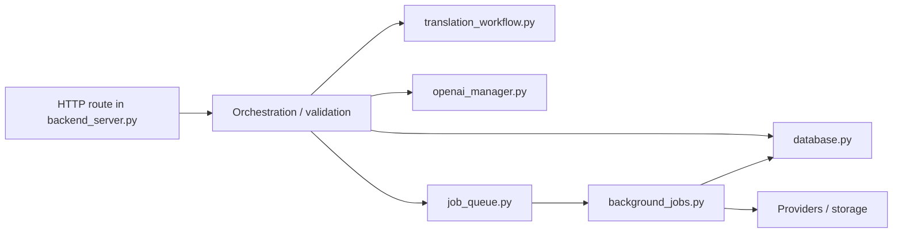

# Backend Study Map

Этот README описывает backend как отдельную учебную подсистему. Его задача: показать, какие backend-процессы существуют, какие модули за что отвечают и в каком порядке их читать.

Сначала имеет смысл прочитать корневой [README.md](../README.md), а уже потом углубляться сюда.

## 1. Backend Boundaries

Backend в этом репозитории не равен одному HTTP-серверу. Это набор связанных runtime-ролей:

- `BACKEND_WEB` -> `backend/backend_server.py`
- `BACKGROUND_JOBS` -> `backend/background_jobs.py`
- `TRANSLATION_CHECK_WORKER` -> `backend/run_dramatiq_worker.py`
- `SCHEDULER_SERVICE` -> `backend/scheduler_service.py`
- `AGENT_WORKER` -> `backend/agent.py`

Общая особенность: почти все эти процессы используют одни и те же доменные модули и `backend/database.py`.

## 2. Backend Entry Points

| Runtime role | Entrypoint | Что делает |
| --- | --- | --- |
| `BACKEND_WEB` | `backend/backend_server.py` | Flask route, auth, orchestration, sync/async decision making |
| Generic worker | `backend/background_jobs.py` | Dramatiq actors для TTS, reader ingest, YouTube, image quiz, analytics side effects |
| Dedicated check worker | `backend/run_dramatiq_worker.py` | translation-check queue polling + stale-job watchdog |
| Scheduler | `backend/scheduler_service.py` | APScheduler owner, который планирует jobs |
| Voice agent | `backend/agent.py` | LiveKit runtime, tool-calls, transcript persistence |

## 3. Module Map

### Core orchestration

| File | Role | Кто импортирует / вызывает | I/O boundary | External services |
| --- | --- | --- | --- | --- |
| `backend_server.py` | Главный backend orchestration file | Gunicorn, bot imports, frontend/iOS HTTP | HTTP request -> JSON/static | PostgreSQL, Redis, Stripe, OpenAI, R2, Google TTS, YouTube, LiveKit |
| `database.py` | DB pool, code-driven schema, DB access helpers | почти все backend runtime | Python params -> SQL rows/domain dicts | PostgreSQL |
| `translation_workflow.py` | Translation/story session logic | `backend_server.py`, tests | session payloads, checking helpers | PostgreSQL, LLM helpers |
| `openai_manager.py` | LLM-heavy functions | `backend_server.py`, `translation_workflow.py`, `api.py` | task params -> model output | OpenAI; Anthropic naming present, active direct path needs verification |

### Queues, workers, scheduling

| File | Role | Кто использует | Notes |
| --- | --- | --- | --- |
| `job_queue.py` | enqueue layer + Redis-backed queue/status helpers | web routes, scheduler, watchdog | основной мост между sync web-path и Dramatiq |
| `background_jobs.py` | Dramatiq actors | worker processes | heavy async work lives here |
| `run_dramatiq_worker.py` | dedicated translation-check worker shell | translation-check service | не generic worker, а отдельный runtime |
| `scheduler_service.py` | APScheduler runtime | scheduler service | только планирует/dispatch'ит |
| `scheduler_jobs_core.py` | scheduler-owned maintenance jobs | `scheduler_service.py`, actors | cleanup, auto-close, daily/system jobs |

### Voice domain

| File | Role | Кто использует | Notes |
| --- | --- | --- | --- |
| `agent.py` | LiveKit agent runtime | AGENT_WORKER | room join, tool-calls, transcript flow |
| `api.py` | `GermanTeacherTools` for agent | `agent.py` | grammar/bookmark/quiz tool layer |
| `voice_session_service.py` | voice session envelope + transcript persistence | `backend_server.py`, `agent.py` | primary voice DB write path |
| `voice_assessment_service.py` | post-session assessment | `/api/assistant/session/complete` | stores structured evaluation |
| `voice_preparation_service.py` | prep-pack handling | assistant/session flows | scenario context preparation |
| `voice_scenario_service.py` | scenario metadata helpers | assistant/session flows | reusable speaking scenarios |
| `voice_skill_bridge_service.py` | convert voice results into skill-state updates | session completion | bridge between voice and skill analytics |
| `agent_worker_schedule.py` | Railway control for voice worker uptime windows | scheduler domain | exact production topology needs verification |

### TTS, audio, storage

| File | Role | Кто использует | Notes |
| --- | --- | --- | --- |
| `tts_generation.py` | backend-server-independent TTS execution helpers | `backend_server.py`, workers | budget checks, Google TTS, R2 upload |
| `tts_scheduler.py` | scheduler-facing wrappers for TTS jobs | `background_jobs.py` | keeps scheduler imports away from full server |
| `tts_ssml.py` | SSML/text shaping helpers | TTS flow | text preparation layer |
| `tts_runtime_state.py` | process-local TTS runtime state | TTS routes/jobs | important scaling caveat |
| `tts_admin_monitor.py` | TTS admin monitoring helpers | TTS flow | part persisted, part process-local |
| `tts_cache_cleanup.py` | stale TTS object/cache cleanup | scheduler jobs | maintenance path |
| `r2_storage.py` | Cloudflare R2 helper | TTS, reader, image quiz | shared object storage layer |

### Dictionary, reader, image quiz, support data

| File | Role | Кто использует | Notes |
| --- | --- | --- | --- |
| `load_freedict.py` | one-time base dictionary loader | manual/admin path | seeds `bt_base_dictionary` |
| `load_wiktionary.py` | one-time WikDict/Wiktionary-derived loader | manual/admin path | seeds `bt_wiktionary_dictionary` |
| `reader_ingest_admin.py` | process one reader document directly | manual admin use | bypasses queue for one document |
| `image_generation_provider.py` | image generation provider wrapper | image quiz flows | currently OpenAI image path |
| `image_quiz_utils.py` | image-quiz normalization and validation helpers | quiz flows | answer normalization |
| `image_quiz_cleanup.py` | image-quiz R2 cleanup | scheduler/maintenance | worker-safe cleanup |
| `grammar_focuses.py` | grammar taxonomy/config | translation/skills logic | domain config, not runtime shell |
| `config_mistakes_data.py` | mistakes config/data | translation feedback flows | domain config |

### Observability, cache, messaging, analytics

| File | Role | Кто использует | Notes |
| --- | --- | --- | --- |
| `observability.py` | shared observability primitives | web + TTS-related paths | extracted to avoid importing full server |
| `hotpath_cache.py` | in-process hot-path cache manager | performance-sensitive flows | process-local cache |
| `analytics.py` | period math and analytics helpers | analytics/progress endpoints | computes summary/timeseries support |
| `telegram_notify.py` | minimal private-message transport | TTS alerts and system messages | direct Telegram Bot API calls |
| `debug_user.py` | manual DB debugging utility | developer/manual use | not part of runtime |

### Tests and requirements

| Path | Role |
| --- | --- |
| `backend/tests/` | focused tests for billing, voice, translation, today, skills and related flows |
| `backend/requirements.txt` | backend-specific dependency pin set |

## 4. How Requests Usually Move Through Backend

### Typical sync path

- request arrives in `backend_server.py`
- route validates auth/payload
- route reads/writes via `database.py`
- route may call helper logic in `translation_workflow.py`, `analytics.py`, `voice_*_service.py`
- response returns immediately

### Typical async path

- request arrives in `backend_server.py`
- route stores minimal state in PostgreSQL and/or Redis
- route calls enqueue helper in `job_queue.py`
- worker consumes actor from `background_jobs.py`
- frontend or bot polls status route

## 5. Backend Hot Paths

Если вы пытаетесь понять, где сосредоточена основная продуктовая логика, начинайте с этих зон:

1. Translation:
   - route in `backend_server.py`
   - `translation_workflow.py`
   - `openai_manager.py`
2. Dictionary:
   - dictionary route group in `backend_server.py`
   - dictionary lookup functions in `openai_manager.py`
   - dictionary/cache tables in `database.py`
3. Cards / FSRS:
   - card route group in `backend_server.py`
   - `backend/srs/fsrs_scheduler.py`
   - card tables in `database.py`
4. Voice:
   - `/api/token`, `/api/assistant/*` in `backend_server.py`
   - `agent.py`
   - `voice_*_service.py`
5. TTS / reader:
   - TTS and reader routes in `backend_server.py`
   - `tts_generation.py`
   - `r2_storage.py`

## 6. Sync vs Async Map

### Usually synchronous

- auth/bootstrap
- instance lease management
- most analytics reads
- FSRS queue fetch/review
- billing status reads
- part of dictionary/base lookup path

### Usually asynchronous

- translation checking
- TTS generation
- YouTube transcript fetch
- reader ingest
- image quiz rendering/preparation
- scheduler-driven cleanup and summaries

### Mixed / caution

- dictionary enrichment can use both immediate response and local background enrichment thread
- TTS flow uses queue-backed work but also process-local state
- scheduler logic is split across `scheduler_service.py`, `scheduler_jobs_core.py`, `background_jobs.py`, and some wrappers in `backend_server.py`

## 7. How To Study Backend

### Phase 1: Runtime shells

Read in this order:

1. `backend_server.py`
2. `background_jobs.py`
3. `run_dramatiq_worker.py`
4. `scheduler_service.py`
5. `agent.py`

Goal:

- understand which process owns which work
- understand where request/queue/real-time boundaries are

### Phase 2: Durable state

Read:

1. `database.py`
2. `backend/tests/` for concrete examples of how helpers are used

Goal:

- learn table families
- learn DB access points
- notice code-driven schema pattern

### Phase 3: Core product flow

Read:

1. `translation_workflow.py`
2. `openai_manager.py`
3. relevant routes in `backend_server.py`

Goal:

- follow one end-to-end product flow before touching edge cases

### Phase 4: Async and maintenance

Read:

1. `job_queue.py`
2. `background_jobs.py`
3. `scheduler_jobs_core.py`
4. `tts_generation.py`

Goal:

- understand which tasks were intentionally pushed out of the web path

### Phase 5: Voice and advanced subsystems

Read:

1. `agent.py`
2. `api.py`
3. `voice_*_service.py`
4. `agent_worker_schedule.py`

## 8. Danger Zones

- `backend_server.py` is both route file and orchestration hub.
- `database.py` is both DB helper layer and migration-like schema owner.
- Some caches and job state are process-local, not fully durable.
- Bot and backend are not cleanly separated; `bot_3.py` imports backend modules directly.
- Voice, TTS and scheduler code are split across several helper files and wrappers.
- `openai_manager.py` is large and should be entered through a known caller, not read top-to-bottom blindly.

## 9. What This README Does Not Replace

- Root [README.md](../README.md) remains the broad architecture map.
- `docs/` contains focused deep dives such as voice and TTS audits.
- `backend/tests/` remain the best place to see some backend functions exercised concretely.
