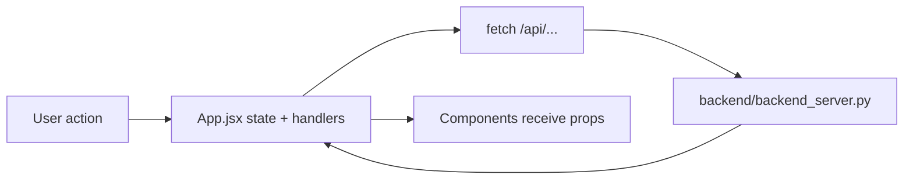

# Frontend Study Map

Этот README описывает frontend как учебную карту: из каких файлов он состоит, где находится основное состояние, как он общается с backend и с чего лучше начинать чтение.

Сначала имеет смысл прочитать корневой [README.md](../README.md), а потом этот файл.

## 1. Frontend Boundaries

Frontend здесь — это в первую очередь Telegram Mini App, но он умеет работать не только внутри Telegram:

- `telegram` mode -> Mini App / Telegram WebView
- `pwa` mode -> standalone install
- `browser` mode -> обычный браузер

Определение режима живёт в `frontend/src/utils/appMode.js`.

## 2. Entry Points

| File | Role | Что делает |
| --- | --- | --- |
| `src/main.jsx` | bootstrap entrypoint | определяет app mode, проверяет свежесть bundle через `/api/webapp/version`, управляет service worker policy, монтирует React app |
| `src/App.jsx` | главный orchestration file | хранит state, вызывает backend route, переключает секции, связывает UI с Telegram/LiveKit/backend |
| `src/theme.css` | общая тема | базовый визуальный слой |
| `src/App.css` | app-specific styles | дополнительный общий стиль |

## 3. File Map

### Components

| File | Role | Как используется |
| --- | --- | --- |
| `src/components/HomeDashboardTiles.jsx` | главная сетка разделов | быстро показывает крупные продуктовые зоны: translations, cards, reader, assistant, YouTube, dictionary, analytics, support |
| `src/components/HomeMoreTiles.jsx` | вторая сетка функций | weekly plan, skills, billing, movies, skill training, economics |
| `src/components/ReaderSection.jsx` | presentation-only reader UI | получает почти всё через props из `App.jsx`; не владеет бизнес-логикой |
| `src/components/LiveKitRuntime.jsx` | thin wrapper around LiveKit components | voice UI/runtime shell |
| `src/components/BlocksTrainer.jsx` | interactive block-based training UI | отдельный учебный interaction mode |
| `src/components/WeeklySummaryModal.jsx` | weekly summary modal shell | открывается поверх app state |
| `src/components/ThreeMascot.jsx` | mascot/presentation component | UI-only |
| `src/components/WebGLMascot.jsx` | WebGL-based mascot/presentation component | UI-only |

### Offline and utilities

| File | Role | Notes |
| --- | --- | --- |
| `src/offline/baseDictCache.js` | IndexedDB cache для offline base dictionary | скачивает и хранит dictionary pack |
| `src/offline/vocabCache.js` | IndexedDB cache для vocab + offline SRS queue/mutations | позволяет частичную offline работу |
| `src/utils/appMode.js` | detect `telegram` / `pwa` / `browser` | runtime mode switch |
| `src/utils/weeklySummary.js` | weekly summary date/math helpers | pure frontend helper logic |
| `src/i18n.js` | i18n-related helper layer | UI texts/internationalization support |

### Styles and tokens

| File | Role |
| --- | --- |
| `src/components/HomeDashboardTiles.css` | tile dashboard styling |
| `src/components/reader-redesign.css` | reader redesign styling |
| `src/styles/topbar-redesign.css` | topbar redesign styling |
| `src/styles/tokens.json` | token data |
| `src/styles/design-tokens.md` | token documentation note |

## 4. Frontend Architecture In Practice

### Что важно понять сразу

- Отдельного API client layer почти нет.
- `App.jsx` напрямую делает `fetch('/api/...')`.
- Большая часть состояния держится в одном файле.
- Некоторые части UI уже вынесены в presentation components, но orchestration всё ещё в `App.jsx`.

### Как это выглядит

## 5. Main State Clusters In `App.jsx`

`App.jsx` лучше читать не подряд, а по тематическим кластерам состояния:

- bootstrap / auth / instance lease / Telegram context
- translation session and checking
- dictionary lookup, save, folders, export
- YouTube transcript, search, watch state
- reader library, reading mode, page navigation, audio
- flashcards / FSRS / manual selection
- today plan / weekly plan / skill progress
- analytics / economics / billing
- support messages
- voice / LiveKit / assistant session

Это делает `App.jsx` главным frontend map file.

## 6. Major Backend Calls From Frontend

### Bootstrap and auth

- `/api/webapp/version`
- `/api/web/auth/config`
- `/api/web/auth/telegram`
- `/api/webapp/bootstrap`
- `/api/webapp/instance/claim`
- `/api/webapp/instance/release`

### Learning flows

- `/api/webapp/start`
- `/api/webapp/check/start`
- `/api/webapp/check/status`
- `/api/webapp/explain`
- `/api/webapp/dictionary`
- `/api/webapp/dictionary/status`
- `/api/cards/next`
- `/api/cards/review`
- `/api/webapp/youtube/transcript`
- `/api/webapp/reader/ingest`
- `/api/webapp/reader/audio`
- `/api/webapp/tts/url`

### Billing and voice

- `/api/billing/status`
- `/api/billing/plans`
- `/api/billing/create-checkout-session`
- `/api/token`
- `/api/assistant/session/start`
- `/api/assistant/session/complete`

## 7. How Telegram WebApp Integration Works

### Runtime mode

`main.jsx`:

- detects whether the app runs inside Telegram
- on Telegram path, cleans up service workers
- on non-Telegram path, attempts PWA registration
- checks `/api/webapp/version` and may force reload if Telegram bundle is stale

### App bootstrap

`App.jsx` then:

- reads Telegram `initData` or URL hints
- requests backend config/bootstrap
- claims a webapp instance lease
- loads initial product state

## 8. Offline and PWA Layer

### `baseDictCache.js`

Stores offline pack from `/api/webapp/dictionary/offline-pack`:

- normalized lemma key
- part of speech
- article
- RU translations and reverse lookup index

### `vocabCache.js`

Stores:

- vocabulary entries
- prefetched SRS queue
- offline pending SRS reviews
- offline vocabulary mutations

Это значит, что frontend не только UI, но и хранит часть локального учебного состояния.

## 9. Recommended Reading Order

### Phase 1: bootstrap

1. `src/main.jsx`
2. `src/utils/appMode.js`
3. `src/App.jsx` around initial app startup

### Phase 2: navigation shell

1. `src/components/HomeDashboardTiles.jsx`
2. `src/components/HomeMoreTiles.jsx`

Это даёт понимание продуктовых разделов без погружения в тысячи строк `App.jsx`.

### Phase 3: one end-to-end feature

Recommended order:

1. translation section in `App.jsx`
2. dictionary section in `App.jsx`
3. reader section in `App.jsx` + `ReaderSection.jsx`
4. voice section in `App.jsx` + `LiveKitRuntime.jsx`

### Phase 4: local persistence

1. `src/offline/baseDictCache.js`
2. `src/offline/vocabCache.js`

## 10. Frontend Danger Zones

- `App.jsx` is the single biggest cognitive load in the frontend.
- Business logic and API orchestration are only partially extracted from UI components.
- State is broad and cross-cutting; one feature can affect another section.
- Telegram mode, browser mode and PWA mode differ at bootstrap time.
- Voice flow adds a second runtime dependency chain through LiveKit.

## 11. What To Keep In Mind While Studying

- `ReaderSection.jsx` is intentionally presentational; the interesting logic is still in `App.jsx`.
- `LiveKitRuntime.jsx` is thin; the real voice orchestration is split between `App.jsx`, `/api/token` and backend voice routes.
- Frontend architecture here is easier to understand by tracing real flows than by looking for strict architectural layers.
