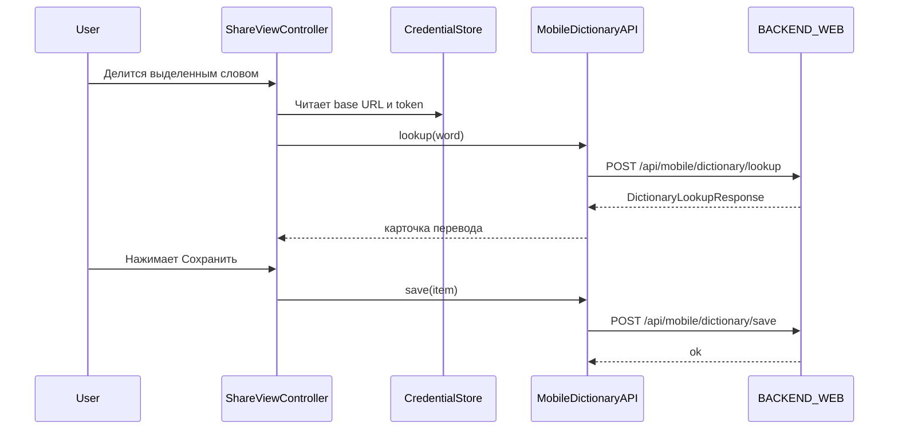

# iOS Share Extension Template

Этот шаблон добавляет к проекту отдельный iOS-клиент и share extension для мобильного словарного сценария. Он не дублирует Telegram Mini App, а даёт компактный нативный путь: взять слово из Safari/Chrome/другого приложения, сделать lookup в backend и сохранить результат в тот же словарь.

## Что реально есть в шаблоне

- Main iOS app с экраном настройки и мобильным dashboard.
- Share extension для быстрого lookup/save из системного меню `Поделиться`.
- Общий credential storage через App Group.
- Вызовы backend mobile endpoint'ов:
  - `POST /api/mobile/auth/exchange`
  - `POST /api/mobile/dictionary/lookup`
  - `POST /api/mobile/dictionary/save`
  - `GET /api/mobile/dashboard`

## Фактическая структура файлов

| Path | Назначение | Кто использует |
| --- | --- | --- |
| `AppEntry.swift` | Текущий `@main` entrypoint iOS app | Main App |
| `MainApp/MobileSetupView.swift` | Экран настройки backend URL, token, smoke test и dashboard | Main App |
| `MainApp/MobileAuthService.swift` | Обмен `initData` на mobile access token через backend | Main App |
| `Shared/CredentialStore.swift` | Хранение `apiBaseURL` и `accessToken` в App Group | Main App + Share Extension |
| `Shared/DictionaryModels.swift` | Codable-модели lookup/save payload'ов | Main App + Share Extension |
| `Shared/MobileDictionaryAPI.swift` | Клиент для mobile dictionary API | Main App + Share Extension |
| `DictionaryShare/ShareViewController.swift` | Share controller для одного extension target | Share Extension |
| `ShareExtension/ShareViewController.swift` | Второй одноимённый controller с тем же кодом | `Needs verification`: какой target реально используется |

### Что было неактуально

- `MainApp/TelegramDeutschMobileApp.swift` в шаблоне нет.
- README теперь ссылается на реальный entrypoint `AppEntry.swift`.

## Как это связано с backend

### Mobile auth

- `MobileAuthService.exchange(initData:apiBaseURL:)`
- route: `POST /api/mobile/auth/exchange`
- результат:
  - backend отдаёт `access_token`
  - token сохраняется в `CredentialStore.accessToken`

### Dictionary lookup

- `MobileDictionaryAPI.lookup(word:)`
- route: `POST /api/mobile/dictionary/lookup`
- вход:
  - `word`
  - `Authorization: Bearer <token>`
- выход:
  - `DictionaryLookupResponse`
  - внутри `DictionaryItem` с переводом, частью речи, артиклем, формами и примерами

### Dictionary save

- `MobileDictionaryAPI.save(item:)`
- route: `POST /api/mobile/dictionary/save`
- вход:
  - `response_json`
  - optional `word_ru`, `word_de`, `translation_de`, `translation_ru`
- выход:
  - `DictionarySaveResponse`

### Dashboard

- `MobileSetupView` содержит локальное расширение `MobileDictionaryAPI.dashboard()`
- route: `GET /api/mobile/dashboard`
- используется для:
  - показа `due_count`
  - показа `new_remaining_today`
  - `word_of_day`
  - deep link'ов обратно в Telegram Mini App

## Пользовательский flow

### Быстрый путь через bot token

1. В личке Telegram-бота выполнить `/mobile_token`.
2. Вставить `base_url` и `access_token` в `Mobile Setup`.
3. Нажать `Сохранить настройки`.
4. Проверить слово кнопкой `Проверить перевод`.
5. Затем использовать Share Extension из браузера или другого приложения.

### Путь через `initData`

1. Main app получает Telegram `initData`.
2. `MobileAuthService.exchange(...)` вызывает `POST /api/mobile/auth/exchange`.
3. Полученный `access_token` сохраняется в `CredentialStore`.

`Needs verification`: в этом шаблоне есть сервис обмена `initData`, но готовый UI-поток для получения самого `initData` из Telegram в iOS-шаблоне явно не реализован.

### Share Extension flow

## Интеграция в Xcode

1. Создать или открыть iOS app target.
2. Добавить `Share Extension` target.
3. Подключить файлы:
   - `Shared/*` в Main App и Share Extension
   - `MainApp/*` и `AppEntry.swift` только в Main App
   - один из `ShareViewController.swift` только в Share Extension target
4. Включить `App Groups` в обоих target'ах.
5. Поставить один и тот же App Group ID.
6. Обновить `CredentialStore.appGroupId` в `Shared/CredentialStore.swift`.

## Важные ограничения

- Share Extension не является Telegram WebApp.
- Он не открывается как floating overlay поверх сайта; это системный share sheet flow.
- Без валидных `apiBaseURL` и `accessToken` lookup/save не работают.
- `CredentialStore.appGroupId` сейчас захардкожен как `group.com.oleksandrkovalenko.bot3weba` и должен быть заменён под реальный проект.
- В репозитории есть два одинаковых `ShareViewController.swift`; target membership нужно проверить и держать в актуальном состоянии.
