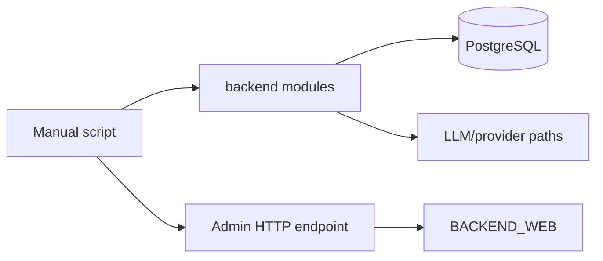

# Scripts Map

Папка `scripts/` содержит не runtime-код приложения, а инженерные утилиты: анализ логов, load tests, model comparison, semantic benchmark tooling, FSRS dry run и служебные импорт/админ-скрипты.

Сначала имеет смысл прочитать корневой [README.md](../README.md), а потом использовать этот индекс.

## 1. Important Rule

Большая часть скриптов в этой папке не предназначена для “безопасного чтения и запуска вслепую”.

Часть из них:

- подключается к PostgreSQL
- использует `backend`-модули напрямую
- вызывает LLM/provider paths
- пишет результаты в файлы
- может создавать или обновлять audit/benchmark rows в БД

Перед запуском нужно читать код скрипта и понимать его side effects.

## 2. Script Categories

### Observability and load analysis

| File | What it does | Inputs / outputs |
| --- | --- | --- |
| `analyze_observability_logs.py` | анализирует structured observability logs для `tts` и `translation_check` flows | log files or stdin -> summary/json |
| `run_translation_load_test.py` | synthetic load test для translation-check flow | base URL, auth/test params, DB access -> staged results/logs |
| `summarize_translation_load_stage.py` | summarises one staged translation load test run | stage artifacts/logs/DB snapshots -> summary |

### Model and prompt comparisons

| File | What it does | Notes |
| --- | --- | --- |
| `compare_translation_models.py` | compares two model paths for the same translation-check cases | uses `run_check_translation_multilang` |
| `compare_translation_models_matrix.py` | compares multiple models on a fixed set | matrix-style experiment |
| `compare_strong_single_vs_batch.py` | compares strong-model single-item vs batched evaluation | A/B experiment |
| `compare_strong_text_vs_structured.py` | compares text output vs structured output | A/B experiment |
| `compare_translation_models.example.json` | small example dataset for model comparison | fixture, not executable script |
| `compare_translation_models.input_template.json` | larger input template for comparison runs | fixture |

### Semantic benchmark / skill evaluation

| File | What it does | Notes |
| --- | --- | --- |
| `build_semantic_benchmark_queue.py` | builds semantic benchmark queue from recent real translation-check sentences | reads DB, writes queue rows |
| `generate_semantic_benchmark_library.py` | generates benchmark library entries from queued candidates | DB + LLM path |
| `run_semantic_weekly_audit.py` | runs periodic semantic audit using library + fresh production attempts | DB-heavy audit script |
| `evaluate_semantic_skill_benchmark.py` | evaluates semantic benchmark quality against current pipeline | DB + translation workflow helpers |
| `evaluate_skill_shadow_cases.py` | evaluates fixed translation cases against shadow-skill pipeline inputs | test/eval helper |
| `semantic_skill_benchmark_cases.example.json` | example benchmark case file | fixture |
| `skill_shadow_eval_cases.json` | default case set for shadow evaluation | fixture |

### Learning-data and admin utilities

| File | What it does | Notes |
| --- | --- | --- |
| `import_lingualeo.py` | imports vocabulary pairs from a simple text/CSV-like source into DB | manual data import |
| `send_daily_audio.sh` | triggers `/api/admin/send-daily-audio` with admin token | direct admin endpoint call |
| `fsrs_dry_run.py` | small local dry run of FSRS scheduling progression | good first script to read |

## 3. Environment Expectations

### Common patterns

Many Python scripts:

- prepend repo root to `sys.path`
- import from `backend.database`, `backend.openai_manager`, `backend.translation_workflow`
- therefore expect backend dependencies to be installed

### Frequently required environment

Depending on the script, you may need:

- `DATABASE_URL_RAILWAY`
- `OPENAI_API_KEY`
- LLM gateway/model env used by `backend.openai_manager`
- access to production-like logs or generated artifact files
- backend admin tokens for admin endpoint scripts

## 4. Recommended Reading Order

### Start with low-risk scripts

1. `fsrs_dry_run.py`
2. `analyze_observability_logs.py`
3. `summarize_translation_load_stage.py`

These are easiest to understand and have the clearest local purpose.

### Then move to evaluation tooling

1. `compare_translation_models.py`
2. `compare_translation_models_matrix.py`
3. `evaluate_skill_shadow_cases.py`

These help you understand how the project team inspects model quality.

### Then read DB-writing audit scripts

1. `build_semantic_benchmark_queue.py`
2. `generate_semantic_benchmark_library.py`
3. `run_semantic_weekly_audit.py`
4. `evaluate_semantic_skill_benchmark.py`

These are more coupled to current database schema and backend internals.

### Read operational scripts last

1. `run_translation_load_test.py`
2. `send_daily_audio.sh`
3. `import_lingualeo.py`

These are the easiest to misuse if you run them without understanding env and target system.

## 5. How Scripts Relate To The Main App

### What this means

- scripts are often thin shells around backend internals
- they are useful for studying the system because they show isolated slices of logic
- but they are not a stable public interface

## 6. Good Study Uses For This Folder

Use `scripts/` to learn:

- how the team measures translation-check quality
- how semantic skill benchmarking is assembled from real production attempts
- how observability data is post-processed
- how operational/admin actions are triggered outside the main UI

## 7. Danger Zones

- `run_translation_load_test.py` can hit real backend infrastructure for a long time.
- semantic benchmark scripts can write queue/library/audit rows into the database.
- model comparison scripts can incur provider cost.
- `send_daily_audio.sh` calls a real admin endpoint if pointed at a live backend.
- import scripts can mutate vocabulary data.
